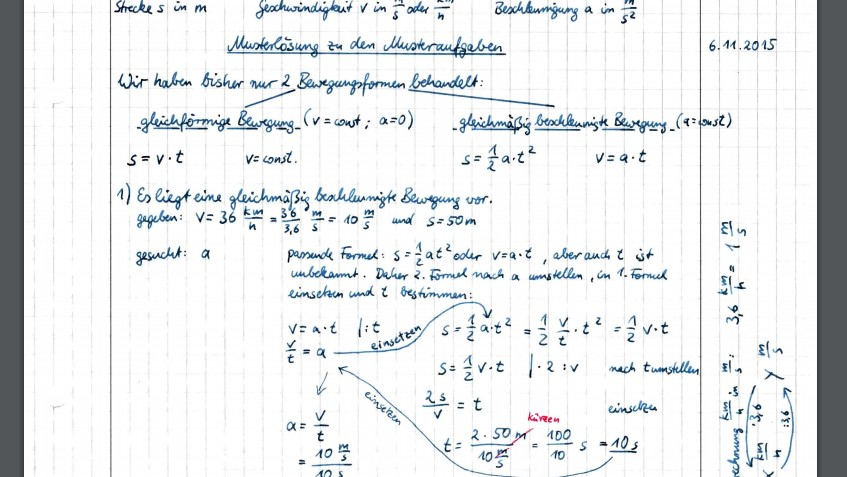

# Kinematik – Physik 10

---
date_created: 2015-11-16
origin: https://hofkoh.de/2015/11/kinematik-physik-10/
---

Aufgaben zur Bewegungslehre wiederholen sich jedes Jahr in den 10. Klassen der Gymnasien. Allgemein haben wir nur die gleichförmige Bewegung und die gleichmäßig beschleunigte Bewegung. Hier ein paar Aufgaben aus 2013 mit Lösung:

- [Aufgaben 13.12.2013](./20131213_Vorbereitungsaufgaben_10c.pdf)
- [Musterlösung 13.12.2013](./20131213_Musterloesung.pdf)

Herbst 2015 kamen 6 weitere Aufgaben hinzu, die fünfte Aufgabe sollte als Hausaufgabe gelöst werden. Besprechung erfolgt am 16. 11. in der 7. Stunde und am 19.11. in der 7. Stunde. Die Klausur wird am 20.11. geschrieben.

- [Aufgaben 06.11.2015](./20151106-Musteraufgaben_Überholen.pdf)
- [Lösung 1 – 3](./Lösung1-3.pdf)  sowie [4 und 5](./Lösung4-5.pdf)

