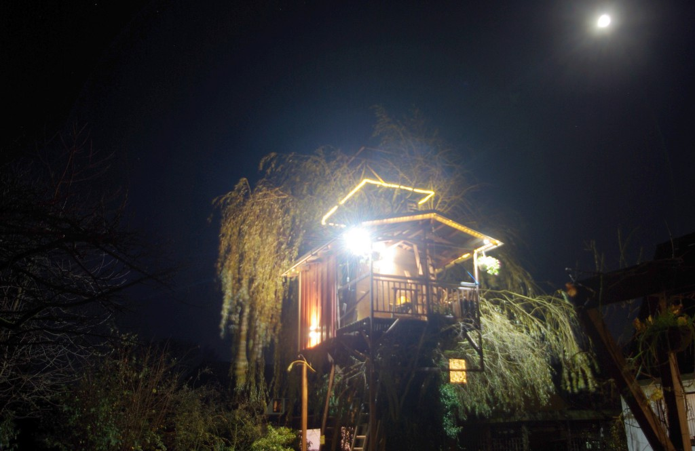
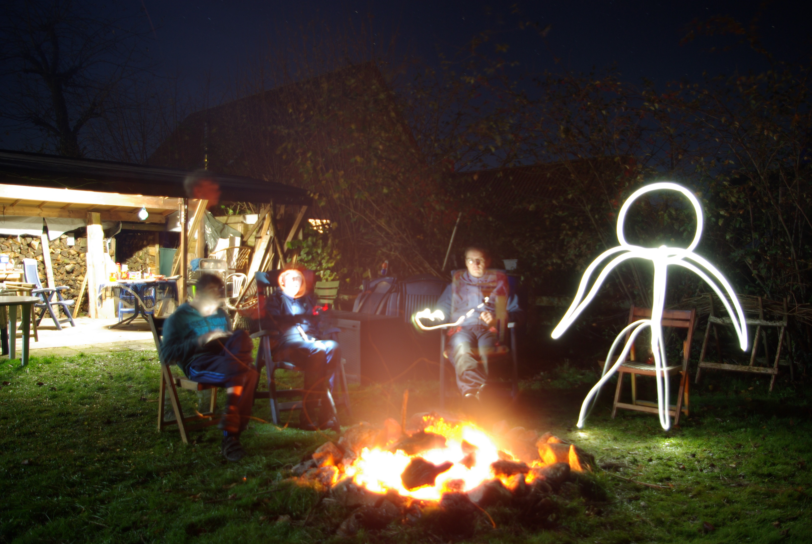
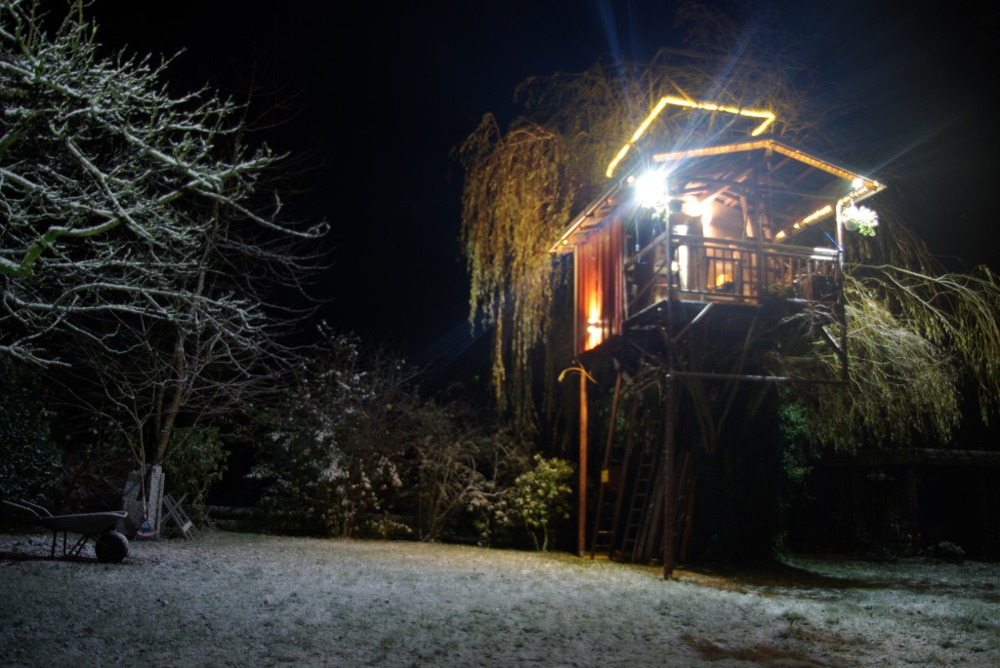

# Fortschritte Baumhausprojekt

---
date_created: 2015-11-25
origin: https://hofkoh.de/2015/11/fortschritte-baumbausprojekt/
---

Wieder einmal bekam ich Besuch von Schülern aus Scheeßel, um das Projekt Baumhaus der Vollendung näher zu bringen. Heutiges Ziel war das fehlende linke Geländer der Terrasse.

Ein wenig sind wir vorwärts gekommen. Außerdem haben wir noch Holz für das Lagerfeuer geschlagen. Bei jenem war Joris nur geistig dabei, während uns jemand anderes Gesellschaft leistete.

In den frühen Morgenstunden fiel dann auch der erste Schnee. Nachdem der Anfang des November eher frühlings-haft war meldete sich hiermit der Winter richtig an.

