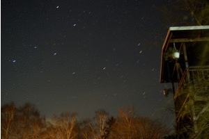
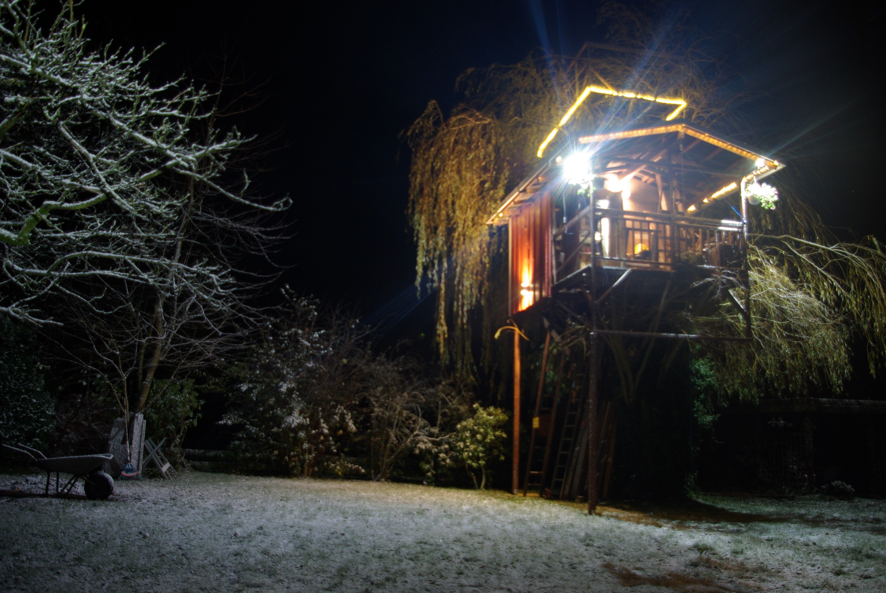

# Sternbilder im Winter

---
date_created: 2015-12-15
origin: https://hofkoh.de/2015/12/sternbilder-im-winter/
---

Mit etwas Langzeitbelichtung sind die Sternbilder auf einer Aufnahme gut zu erkennen. Im Verlauf einiger Minuten sieht man die Drehung des Sternhimmels, hier in einem animierten GIF zusammengefasst.

Und auch das Baumhaus sieht mit Licht besser aus:

