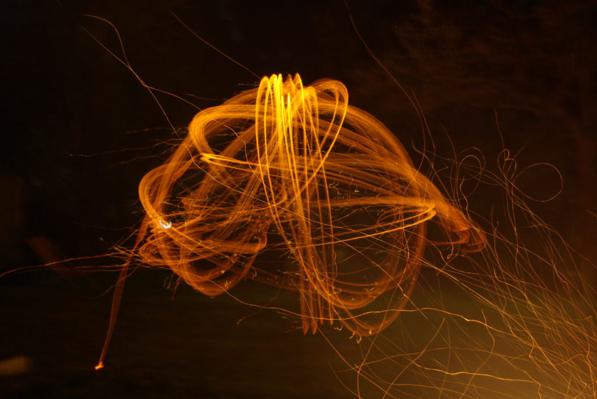

# Lagerfeuer und Lightpainting

---
date_created: 2016-04-23
origin: https://hofkoh.de/2016/04/lagerfeuer-und-lightpainting/
---

Natürlich kann man auch am Lagerfeuer mit der Langzeitbelichtung einer Spiegelreflexkamera experimentieren. Ein brennender Stock erzeugt nach ein paar Sekunden ein einmaliges Kunstwerk:

