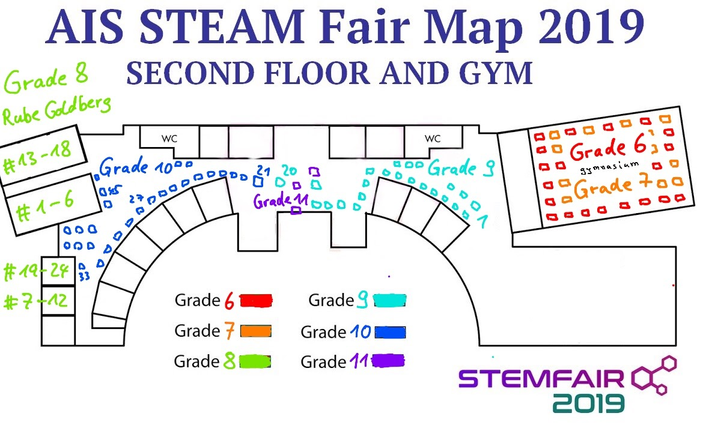

# Sciencefair 2019

---
date_created: 2019-03-05
origin: https://hofkoh.de/2019/03/sciencefair-2019/
---

Seit 1,5 Jahren arbeite ich jetzt an der AIS – American International School Vietnam – als Lehrer für Physik und Chemie in der Highschool (Klasse 9 bis 12). Seit einigen Jahren gibt es im Frühjahr eine Sciencefair, bei der die Schüler ihre Projekte der Öffentlichkeit vorstellen können.

Um auch in Zukunft darüber zu berichten habe ich mir eine neue Domain zugelegt: 

[https://stemfair.org](https://stemfair.org) 

Da die einzelnen Exponate erst in letzter Sekunde fertiggestellt werden ist zur Zeit noch wenig Dokumentation vorhanden:

So sollen die Projekte ausgestellt werden.

Eine Übersicht für den 7. März 2019 gibt es hier:

[https://sites.google.com/ais.edu.vn/sciencefair2019]](https://sites.google.com/ais.edu.vn/sciencefair2019)

Etwas mehr Details und Bilder sind von 2018 dokumentiert:

[https://sites.google.com/ais.edu.vn/sciencefair2018](https://sites.google.com/ais.edu.vn/sciencefair2018)

Unter den einzelnen Klassen gibt es weitere Details. Und da ich fast alle 10. Klassen letztes Jahr in Chemie unterrichtet habe, hat auch fast jedes Projekt eine Webseite zum Erreichten. Einfach auf der folgenden Seite etwas nach unten scrollen:

[https://sites.google.com/ais.edu.vn/sciencefair2018/grade-10](https://sites.google.com/ais.edu.vn/sciencefair2018/grade-10)

Eindrücke von diesem Jahr werden in Kürze aktualisiert.
