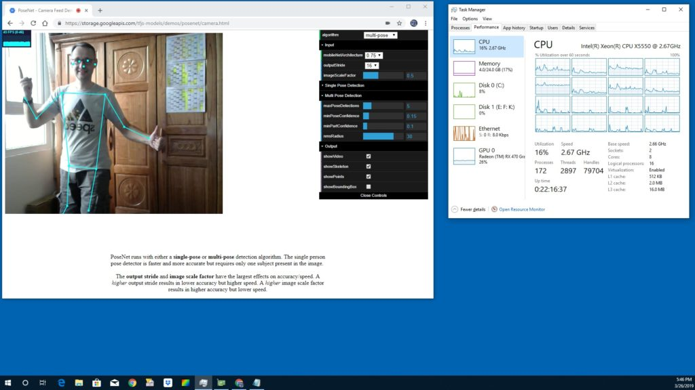

# AI und ML

---
date_created: 2019-03-26
origin: https://hofkoh.de/2019/03/ai-und-ml/
---

Von künstlicher Intelligenz (AI – artificial intelligence) wird schon seit Jahrzehnten geredet und geforscht. In letzter Zeit ist Machine learning ML dazugekommen und wird im Alltag fleißig eingesetzt.

Allgemein muss man dazu aber entweder Entwickler bei Amazon, Google oder Apple sein – oder an einer Universität studieren. Modell entwickeln? Trainieren? Klingt speziell und braucht bestimmt viel Entwicklungszeit. Und spezielle Installationen (Ubuntu 16.04 oder 18.04, python 2.6 oder 3.4, CUDA, Darknet, Docker, KERAS und wie sie alle heißen) sind zu speziell für die meisten Benutzer.

Eine einfache Lösung: Nutze doch deinen Browser! Seit etwa einem Jahr gibt es tensorflow.js als Javascript im Browser und das geht sowohl auf Laptop, Tablet und Smartphone. Versuchen wir mal eine Objekterkennung:

Dank neuer RX470 mit 46 fps!

Der passende link hierzu ist:

[https://storage.googleapis.com/tfjs-models/demos/posenet/camera.html](https://storage.googleapis.com/tfjs-models/demos/posenet/camera.html)

Es funktioniert in Japan, Taiwan und Vietnam, mit vielen Personen im Bild, alten iPhones und neueren Samsungs. Die Bildwiederholrate ist nicht immer so toll, gibt aber einen Eindruck in die Möglichkeiten.

*** Video ***

Google I/O 2018 Vorstellung und Hintergrund zu TensorFlow.js
