# 12 years down - 4 more years to go

It's puzzling to realize how much time I spent to get an education. By 2025 I used 12 years of my life to get professional training, in addition to my 10 years of regular school attendance. That's right, I don't have a high school diploma (Abitur in Germany). But I taught high school kids and helped them improve their grades.

## Kommunikationselektroniker - 3 years

My first professional education is from vocational training at the **Deutsche Telekom AG**, Niederlassung Potsdam on the Telegrafenberg. It usually requires 3.5 years, but I could shorten it with 4 other students to just 3 years. The official description is **Kommunikationseletroniker Fachrichtung Fernmeldetechnik** (communication eelectronics technician, specialized in telecommunication).

## Diplom-Physiker - 7.5 years

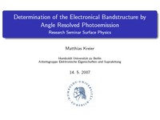 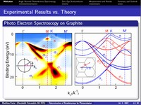 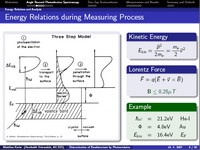 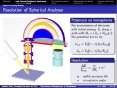

I started to study physics at the **Humboldt Universität zu Berlin** in 2000. This is before the bachelor and masters degree were introduced in Europe following the _[Bologna process](https://en.wikipedia.org/wiki/Bologna_Process)_. The diploma I received is now considered equal to a **masters degree**.

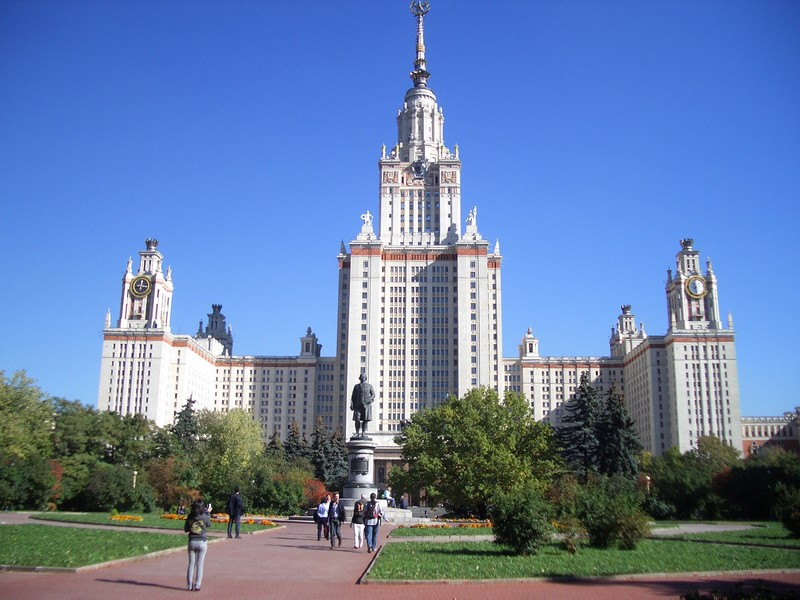 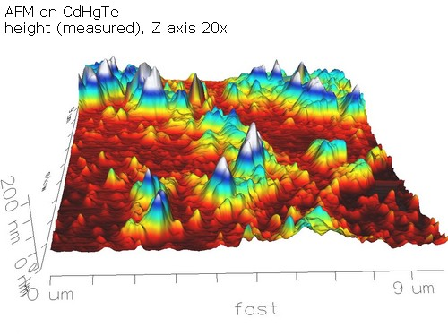

The regular study time (Regelstudienzeit) for physiks is 5 years. But I spent 2 semester at the **MSU - Moscow State University** (МГУ Моско́вский госуда́рственный университе́т и́мени М. В. Ломоно́сова) in Russia. And I invested 1.5 years into the investigation of **HgCdTe Narrow-Gap Semiconductors** at the HU and [BESSY](https://en.wikipedia.org/wiki/BESSY) (Elektronenspeicherring-Gesellschaft für Synchrotronstrahlung m. b. H.). The work is reflected in my diploma thesis _"Elektronische Eigenschaften von CdxHg1-xTe mit 0.07 < x < 0.4"_ ([link ](https://people.physik.hu-berlin.de/~kreier/thesis/20080124.pdf)to the document on [my university homepage](https://people.physik.hu-berlin.de/~kreier/en/index.html)).

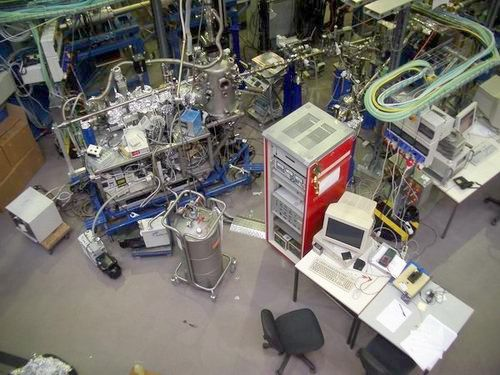 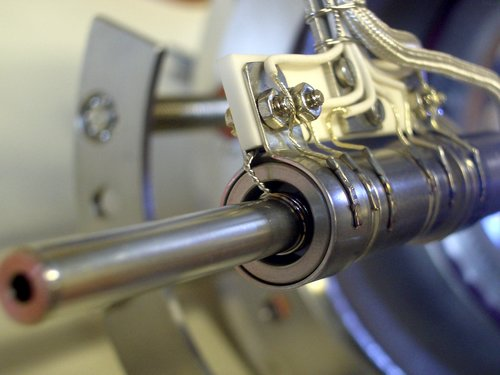 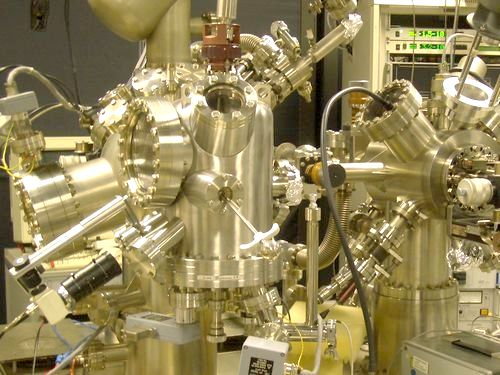

The diploma system does not have a mayor and minor part. You are only required to study an additional subject for one semester. I chose **physical chemistry** (Physikalische Chemie) by Prof. Rademann in 2001 with a practica (many experiments and lab reports) over the summer break. This was really fun!

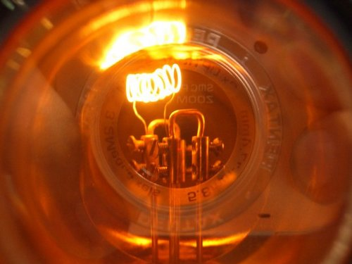 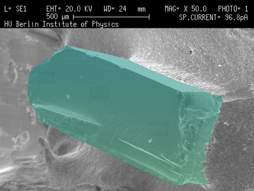

This degree allowed me to teach Math, Physics, Chemistry and Computer Science at public schools in Germany. In 2012 I finally decided to officially **become a teacher** and get a teaching license.

## Oberstufenlehrer für Mathematik und Physik im Niedersächsischen Schuldienst - 1.5 years

Teachers in Germany study for a **master of education** at universities. But that is only the first step, therefore called **Erstes Staatsexamen** (first state exam). To qualify as a teacher you also need to pass your **Zweites Staatsexamen** (second state exam), which usually requires an additional **2 year** training period called **Referendariat** with a teaching obligation of 10 hours per week and lectures at a specialized institute.

I started my 'Referendariat' at the **Studienseminar Stade** in Lower Saxony. To save costs the state had reduced the training time to 1.5 years. While living in [Hofkoh](https://maps.app.goo.gl/PvuLH3SPogwbHaJb6), I was travelling to the [Studienseminar Lehramt an Gymnasien](https://maps.app.goo.gl/YxNtFVbhnGYUz6uA6) (45 kilometers), continued to the [Gymnasium Warstade](https://maps.app.goo.gl/D7gsmh1csmFUWzkD8) in Hemmoor (another 29 kilometers) and after a day of work with frequent visits to my lectures traveled the 56 kilometers back home on most days of the week. It was a stressful time 2012/08 - 2014/01.

## Teaching in the English language - 5 years

My teaching degree brought me to Saigon in Vietnam, but I only taught in German for 1 year. After that I worked 3 years for the **American International School Vietnam** and 2 years for the **Saigon South International School**. The topics span a variety of subjects and include the American curriculum, IB Diploma Program and AP Advanced Placement. For the IB and AP I received special training. Here is a list:

- IB Physics HL/SL (training in Jakarta)
- Chemistry
- Integrated Science 9/10 (biology, chemistry and physics)
- MYP Design (training in Bangkok)
- IB Physics A (training in Sacramento)
- High School Math
- AP CSP Computer Science Principles (training in Baltimore)
- Live Science
- Advanced Automation

From a certain perspective I was successful with my teaching. In IB Physics at the AISVN we never had an SL student receive 6 points, and only one time in the past a student had received 6 points on HL higher level. No one ever got 7 points. I wanted to change that. 

My first 2-year course started in 2018, and the results of 2020 were remarkable All 15 students passed, both SL and HL. And some students received 6 and 7 points as their IB score, both HL and SL. Usually the best subject at AISVN is _IB Vietnamese Literature_ with an average slightly above 6 points, and for obvious reasons. But in 2020 the best subject was **IB Physics HL** with an average of **6.5 IB points**! Two students scored 6 points, two students scored 7 points. I am very proud of my students!

The work at SSIS was also both challenging and rewarding. In 2022-2023 I supervised 2 ASAs (after school activities): The **SSIS Robotics club** with VEX V5 and the game developer club **Unity Impact**. At the end of the year we also absorbed the remaining students of the **Girls Code** club into our Unity Impact club.

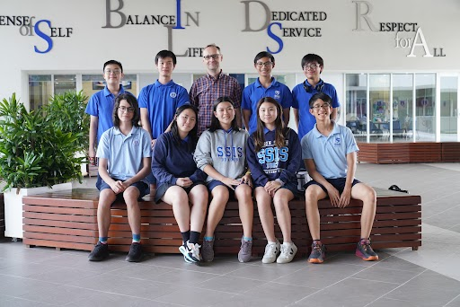

The start for VEX was not easy, since I was completely new to the program. Until the end of 2022 no student could travel, so we could not take the students to the Signature Event in Taipei at the TAS to give them some experience in this competition. But early 2023 we set a new Vietnamese record for [12 attending teams](https://www.robotevents.com/robot-competitions/vex-robotics-competition/RE-VRC-22-1135.html#results-) from 5 schools at the **Vietnam National Championship 2023** Spin Up.

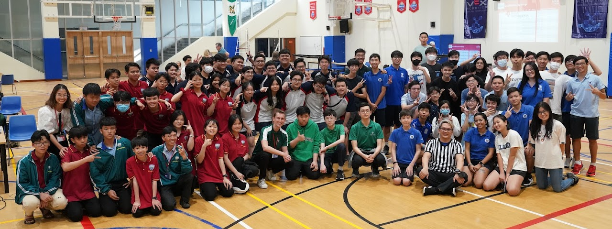

And for the first time we had a **Middle School Team** in Vietnam. Now there were 2 spots available to represent Vietnam at the World Championship in Dallas. And I was coaching both winning teams, so I could travel with both teams to the United States:

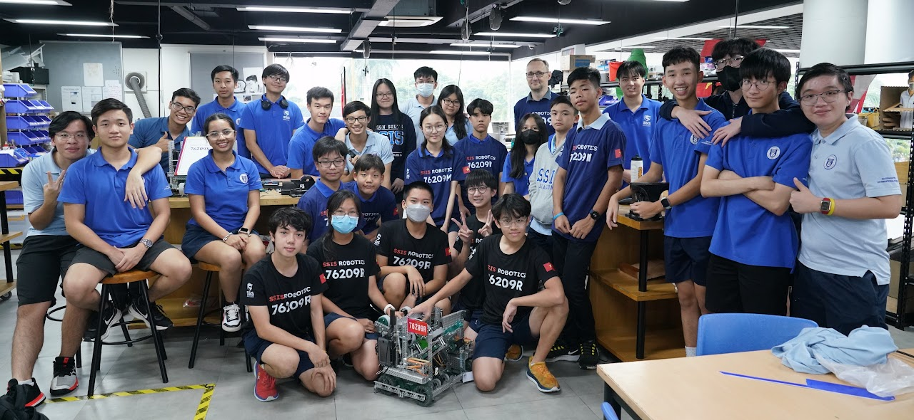

We had a great time in Dallas. It was a nice experience for the students, they progressed so much in the coming years and returned to Dallas in 2025!

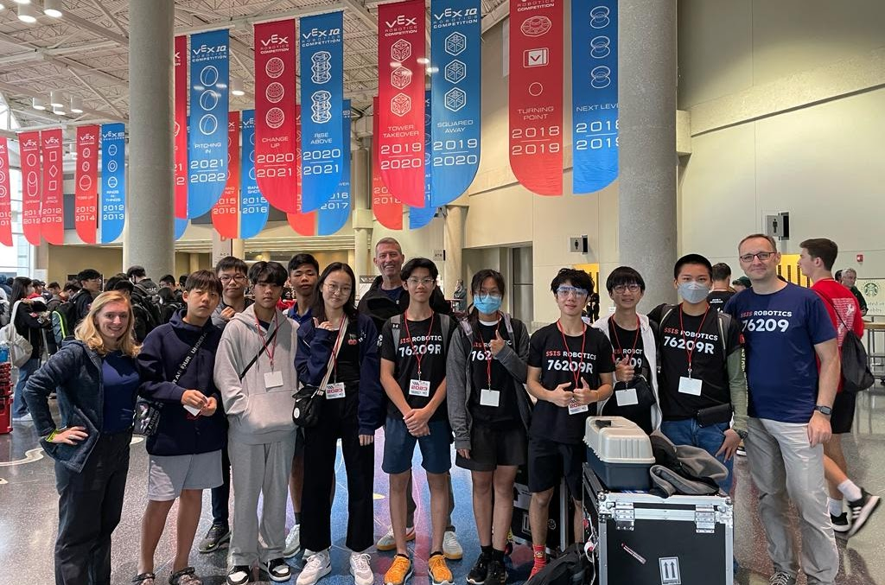

Now it's time for me to improve my Vietnamese. I have lived in this country for 9 years already!

## Ngành Tiếng Việt và Văn hóa Việt Nam - 4 years

I started applying for _Ngành Tiếng Việt và Văn hóa Việt Nam_ (Vietnamese Language and Culture of Vietnam) at the _Trường Đại học Sư phạm TP. Hồ Chí Minh_ (Su Pham university) since May 2024, but the requirements to start this course were not met. The course is intended for 20 students, the university required at least 15 students to sign up. By October 2024 we were only 7 Students.

In 2025 the requirements were lowered to at least 10 students, but by the end of the signup period in July 2025 we were only 3 students. September 1st we were 4, and Ms. Tân could convince the board of directors to start the course anyway. The opening ceremony on September 21st was only attend by 2 of our students, the others were still in Korea and China. In October 2025 we have already **7 students**! I went to Cambodia for 2 weeks to get my 1-year visa.

It will take 4 years to receive my **bachelor degree** (bằng cử nhân). The story continues until 2029. By then I will have spent 26 years as a student, almost 50% of my life!
